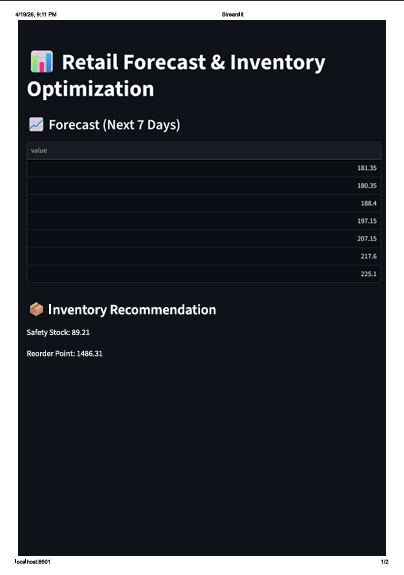
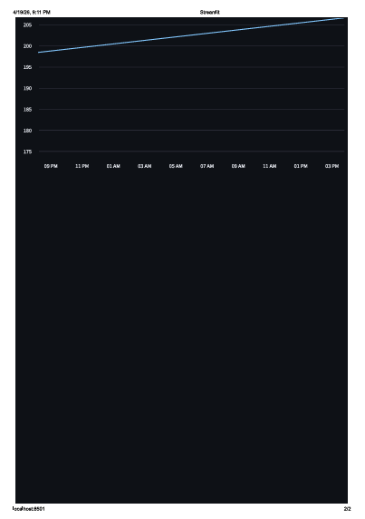
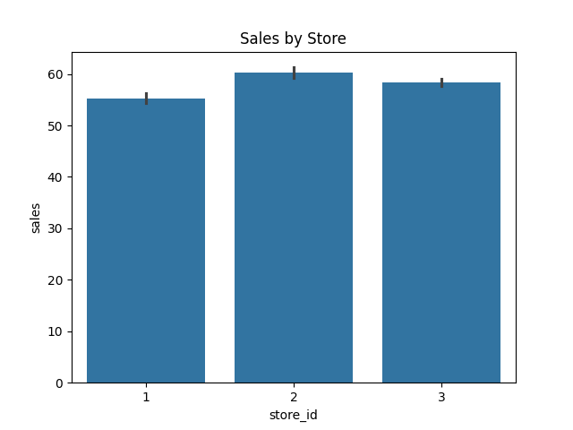

\# 📊 Retail Sales Forecasting \& Inventory Optimization System


\## 🚀 Project Overview

This project is an end-to-end \*\*Retail Analytics System\*\* that predicts future sales and optimizes inventory decisions using Machine Learning.


It simulates how modern retail companies like Amazon, Flipkart, and Reliance Retail manage demand forecasting and stock optimization.


\---


\## 🎯 Problem Statement

Retail businesses often face:

\- ❌ Stockouts → Lost sales

\- ❌ Overstock → High holding costs


This project solves these problems by:

\- 📈 Forecasting future demand

\- 📦 Recommending optimal inventory levels


\---


\## 💡 Business Value

\- Improves demand planning  

\- Reduces inventory costs  

\- Prevents stock shortages  

\- Supports data-driven decision making  


\---


\## ⚙️ Tech Stack

\- Python  

\- Pandas, NumPy  

\- Scikit-learn  

\- Matplotlib  

\- Streamlit  


\---


\## 🏗️ Project Architecture


\---


## 📸 Dashboard Preview

### 🔹 Main Dashboard


### 🔹 Forecast Visualization


### 🔹 Model Output Graph



## 📊 Sample Output

- Forecast (Next 7 Days): 180 → 226 units  
- Safety Stock: 89 units  
- Reorder Point: ~1480 units


\## ⚙️ Installation


\### 1. Clone the repository

```bash

git clone https://github.com/YOUR\_USERNAME/retail-sales-forecasting-inventory-optimization.git

cd retail-sales-forecasting-inventory-optimization

